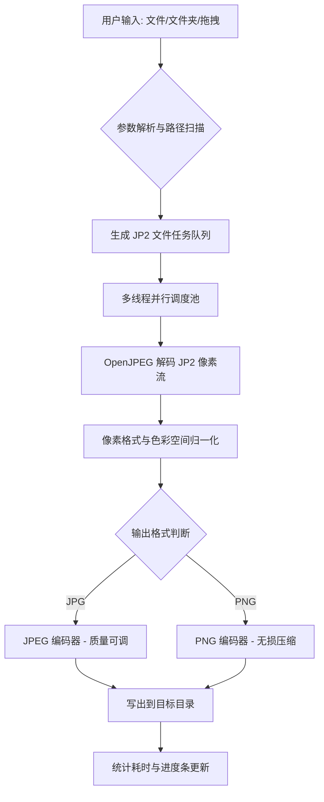
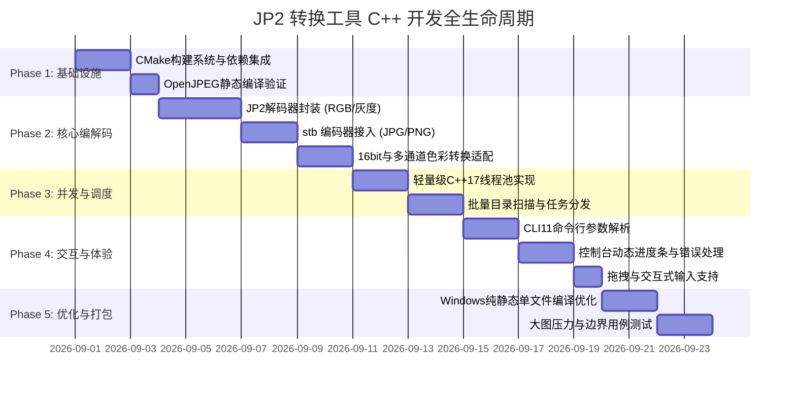

# JP2 转 JPG / PNG 离线转换工具 (C++) 需求与技术设计文档

---

## 1. 项目背景与目标

### 1.1 背景
JPEG 2000 (`.jp2`, `.j2k`) 格式常用于高分辨率数字典藏（如美国国会图书馆书籍扫描、地理测绘、医学影像等），具有极高的压缩比和无损/有损支持。但由于 Windows 系统原生不直接支持 JP2 预览，常规用户需要将其批量转换为通用的 JPG 或 PNG 格式。

现有方案基于 Python + `pyvips`，存在以下痛点：
1. **环境依赖沉重**：需手动下载数十兆的 `libvips` 二进制包、配置系统 PATH 环境变量并安装 Python/pip 依赖。
2. **部署门槛高**：在未安装 Python 运行时的机器上无法直接双击运行。
3. **跨机器分发困难**：无法做到"即拷即用"的绿色单文件体验。

### 1.2 目标
使用 **C++ (C++17/20)** 重构该工具，打造一款**轻量、高性能、开箱即用、完全离线且零依赖**的 JP2 批量转换工具（CLI / 极简绿色工具）。

---

## 2. 功能需求说明



### 2.1 核心功能
1. **多格式输入输出**：
   - **输入支持**：`.jp2`、`.j2k`、`.jpf`、`.jpc`。
   - **输出支持**：
     - **JPG**：支持指定压缩质量（1~100，默认 90/95）。
     - **PNG**：支持无损输出，保留高保真细节。
2. **灵活的转换模式**：
   - **单文件转换**：指定单个 `.jp2` 文件转换为对应 `.jpg` 或 `.png`。
   - **批量文件夹转换**：支持指定输入目录，自动在目标路径（或源目录下的 `converted_images` 文件夹）生成转换后文件。
   - **递归扫描**：支持可选递归遍历子文件夹并保持原始目录结构。
   - **双击与拖拽支持**：支持直接将文件夹或文件拖拽到 `.exe` 图标上即刻开始转换。
3. **图像与色彩适配**：
   - 支持灰度图 (Grayscale, 1 通道)、RGB (3 通道)、RGBA (4 通道)。
   - 支持 1~16 bit 位深自动向下映射/量化为标准 8-bit 显示格式。
   - 正确处理色彩空间（sRGB、Linear 等），避免转换后偏色。
4. **性能与多线程并发**：
   - 自动检测 CPU 物理核心数，基于多线程任务池实现文件级并行转换。
   - 支持用户自定义最大并发线程数（如 `-t 8`）。
5. **交互与用户体验**：
   - 控制台彩色日志与实时进度条（如 `[45/100] 45% [=====>     ] image_01.jp2 -> image_01.jpg`）。
   - 转换完毕统计（成功数、失败数、总耗时、平均每张耗时）。
   - 异常容错处理：单个损坏损坏文件报错跳过，不中断整批任务。

---

## 3. 非功能需求

| 维度 | 要求说明 |
| :--- | :--- |
| **离线与便携性** | 编译为**单个独立的 `.exe` 可执行文件**（静态链接 MSVC CRT / OpenJPEG / 编码库），无任何第三方 DLL 依赖，纯离线运行。 |
| **内存与资源** | 流式文件读写，按图片解压处理并立即释放内存，严防大图批处理时的内存泄漏与 OOM。 |
| **执行性能** | 利用现代多核 CPU 并发，单张 10~20MB 的高清 JP2 解码与重编码耗时控制在毫秒级至秒级。 |
| **兼容性** | 完美运行于 Windows 7/10/11 (x64) 及主流 Linux 发行版。 |
| **代码规范** | 采用现代 C++ (C++17 及以上)，模块化分层设计，异常安全。 |

---

## 4. 技术栈选型方案

针对“离线、零依赖、高性能”目标，推荐两种技术栈搭配路线：

### 推荐方案：轻量高性能标准组合 (OpenJPEG + stb_image_write / libjpeg-turbo)

```
+-------------------------------------------------------------+
|                      用户交互与命令行解析                     |
|         CLI11 (Header-only) 或 极简原生交互 CLI              |
+-------------------------------------------------------------+
                              |
+-------------------------------------------------------------+
|                     任务调度与并发引擎                       |
|           C++17 std::filesystem + 自定义轻量线程池           |
+-------------------------------------------------------------+
                              |
+-------------------------------------------------------------+
|                    核心编解码处理管道                        |
|  [JP2 解码]  : OpenJPEG 2.5+ (静态编译，官方标准 JPEG 2000 库) |
|  [像素转换]  : 8/16bit 转换、通道重排 (RGB/Grayscale/RGBA)     |
|  [图像写出]  : stb_image_write (Header-only) 或 libjpeg/png  |
+-------------------------------------------------------------+
```

### 组件选型对比与决策

| 模块 | 候选库 | 选用决策 | 优势与理由 |
| :--- | :--- | :--- | :--- |
| **JP2 解码** | OpenJPEG vs FreeImage vs OpenCV | **OpenJPEG (`openjp2`)** | 官方参考实现，体积小（静态库仅约 300KB），协议友好（BSD），解码标准度最高。 |
| **JPG/PNG 编码** | `stb_image_write.h` vs `libjpeg-turbo` + `libpng` | **默认：`stb_image_write`**<br>*(可选扩展：turbo)* | 仅一个单头文件，无需编译任何第三方 DLL，零配置即可实现高质量 JPG/PNG 导出，静态产物体积极小。 |
| **多线程与并发** | `std::thread` / ThreadPool vs OpenMP | **C++17 原生线程池** | 原生跨平台，精细化任务分配，易于与进度通知回调解耦。 |
| **文件与系统** | Boost.Filesystem vs `std::filesystem` | **`std::filesystem` (C++17)** | 标准库原生支持，零外部依赖，支持优雅的路径拼接与扫描。 |
| **命令行解析** | `CLI11` vs `cxxopts` | **`CLI11` (Header-only)** | 功能强大（支持选项验证、位置参数、子命令），单个 `.hpp` 头文件即用。 |
| **构建管理** | CMake + vcpkg / FetchContent | **CMake 3.16+** | 跨平台标准，可配合 `FetchContent` 自动下载并静态编译依赖，一键构建。 |

---

## 5. 系统架构与模块划分

```
jp2converter/
├── CMakeLists.txt              # 构建配置（支持静态编译）
├── include/
│   ├── converter_engine.hpp    # 转换核心管道接口
│   ├── jp2_decoder.hpp         # OpenJPEG 解码封装
│   ├── image_encoder.hpp       # JPG/PNG 编码封装 (stb_image_write)
│   ├── thread_pool.hpp         # 现代化轻量线程池
│   ├── cli_options.hpp         # 命令行参数配置与解析
│   └── progress_bar.hpp        # 终端进度条与日志
├── src/
│   ├── main.cpp                # 程序入口与交互逻辑
│   ├── converter_engine.cpp    # 批处理调度与格式转换实现
│   ├── jp2_decoder.cpp         # JP2 解码实现 (流/内存模式)
│   └── image_encoder.cpp       # 编码写入逻辑
└── third_party/                # 第三方依赖（header-only 或 FetchContent）
    ├── stb_image_write.h
    └── CLI11.hpp
```

### 核心处理逻辑规范
1. **解码阶段**：通过 OpenJPEG 将 JP2 字节流解析为 `opj_image_t` 结构体，获取分辨率、色彩空间、通道数及采样位深。
2. **归一化阶段**：
   - 若每个通道采样位深为 16-bit，使用动态范围缩放公式映射至 8-bit（`pixel_8 = (pixel_16 * 255) / max_val`）。
   - 将各个分离的颜色分量平面（Planar 格式）重排为交错连续内存（Interleaved RGB/RGBA 格式：`RGBRGBRGB...`）。
3. **编码阶段**：
   - 目标为 JPG：调用 `stbi_write_jpg(filename, w, h, comp, data, quality)`。
   - 目标为 PNG：调用 `stbi_write_png(filename, w, h, comp, data, stride_in_bytes)`。

---

## 6. 开发实施计划（五阶段）



### 阶段明细
- **第一阶段：环境与工程骨架（1~2天）**
  - 配置 `CMakeLists.txt`，设置 MSVC / GCC 静态链接选项（`/MT` 或 `-static`）。
  - 配置 OpenJPEG 的拉取与编译（利用 CMake `FetchContent` 或预编译静态库）。
- **第二阶段：单图编解码引擎研发（3~4天）**
  - 编写 `jp2_decoder.cpp`：支持内存/文件流式读取并转为内存 Buffer。
  - 编写 `image_encoder.cpp`：集成 `stb_image_write.h`，实现 JPG 质量参数与 PNG 导出。
  - 编写单元测试验证单张 JP2 转 JPG/PNG 的保真度与色彩准确度。
- **第三阶段：多线程任务调度系统（2~3天）**
  - 编写无死锁任务队列线程池 `ThreadPool`。
  - 使用 `std::filesystem` 编写目录扫描与输出路径生成逻辑。
- **第四阶段：CLI 交互与人性化体验（2~3天）**
  - 实现命令参数：`--input`、`--output`、`--format` (jpg/png)、`--quality` (1-100)、`--threads` (并发数)、`--recursive` (递归)。
  - 若无参数启动，提供人性化交互提示（支持用户直接粘贴目录路径或拖拽）。
  - 接入终端动态进度条与错误日志统计。
- **第五阶段：性能调优与单文件静态打包（2天）**
  - 开启全程序优化 (LTCG / LTO) 与 Release 性能调优。
  - 生成绿色免安装单文件 `jp2convert.exe`，进行无 Python / 纯净机环境运行测试。

---

## 7. 命令行接口设计 (CLI Preview)

```bash
# 1. 极简用法：转换指定文件夹下的所有 JP2 为 JPG (默认输出到 input_dir/converted_images)
jp2convert -i "D:/Books/LOC_001"

# 2. 指定输出目录与格式为 PNG
jp2convert -i "D:/Books/LOC_001" -o "D:/Output/PNGs" -f png

# 3. 指定输出 JPG 质量为 95，启用 8 线程并发，并递归子目录
jp2convert -i "D:/Books" -o "D:/Output" -f jpg -q 95 -t 8 -r

# 4. 单文件转换
jp2convert -i "D:/Books/page_001.jp2" -o "D:/Books/page_001.jpg"

# 5. 零参数双击运行：控制台弹出交互式输入引导，支持拖拽路径
```

---

## 8. 边界条件与风险应对

1. **大图像高分辨率内存占用**：
   - *对策*：线程池设定并发上限，及时析构中间 `opj_image_t` 和临时像素缓冲区；单图完成后立即释放。
2. **非标色彩空间与位深（如 12-bit / 16-bit 扫描图）**：
   - *对策*：解码时检查 `image->comps[i].prec`，若大于 8 则按比例动态缩放至 8-bit，防止直接截断导致画面过曝或发黑。
3. **CMYK 或多光谱通道**：
   - *对策*：针对非常规通道数（如 4 通道 CMYK），增加软转换转为 sRGB。
